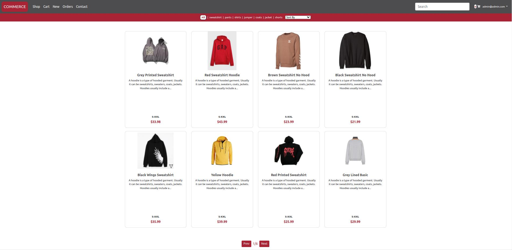
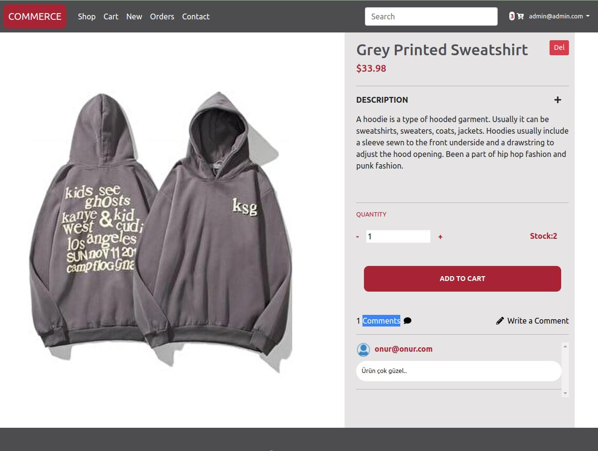

# Week4 Homework Project Live Link

("https://bootcamp-final-out.netlify.app")

Admin email: orionbootcamp@gmail.com
Admin pass: Orion123

# You-tube Project Explanation Video Link

("https://youtu.be/W5ubadZA9RA")

# Importan Note:

## Admin : username: orionbootcamp@gmail.com , password : Orion123

You can login with this username and password if you want to check my project as admin or you can register with a random e-mail address to check the project as customer.

   

## Summary

Hello There;
On this e-commerce site that I coded for a week,
I tried to use a modular structure in this e-commerce project. With TypeScript, I took care to assign types to all data types and also tried to take advantage of all the modules Angular offers us to increase the project performance.I would like to briefly talk about the features I use;

<strong>Reactive Forms</strong>
<strong>Custom Validations</strong>
<strong>Fire Reader Library</strong>
<strong>Route Guards</strong>
<strong>Interceptors</strong>
<strong>Resolvers</strong>
<strong>Lazy Load(Preloading-Strategy)</strong>

   

and also i used Google-Firebase backend-services for this project

<strong>Firebase Auth Module</strong>
<strong>Firebase Realtime Database Module</strong>
<strong>Firebase Storage (store files)</strong>

In this project as you can watch on youtube video, there is a user interface for a customer and a admin interface. Customers can buy see details of products and add products to their shoppin carts and checkout. Admin iterface can upload/delete products on website and check orders from customers checkouts to ship.

   

<strong>Bootstrap</strong>
<strong>Scss</strong>
<strong>FontAwesome</strong>

For styling i used Bootstrap,Scss and FontAwesome.During coding the project sometimes i need some special mediaqueries to make project real responsive. For example you can find that changes on login.component.scss file.

## Some SS from Project

## download and run

1-install Angular CLI version 13 or 14
2-open a terminal and run
git clone "https://github.com/164-orion-innovation-turkey-bootcamp/hafta4-odev-assignment-onurutku.git"
3-run "npm install" to call node modules.
4-run "ng s --o"

# Thank You.

This project was generated with [Angular CLI](https://github.com/angular/angular-cli) version 13.1.4.

## Development server

Run `ng serve` for a dev server. Navigate to `http://localhost:4200/`. The app will automatically reload if you change any of the source files.

## Code scaffolding

Run `ng generate component component-name` to generate a new component. You can also use `ng generate directive|pipe|service|class|guard|interface|enum|module`.

## Build

Run `ng build` to build the project. The build artifacts will be stored in the `dist/` directory.

## Running unit tests

Run `ng test` to execute the unit tests via [Karma](https://karma-runner.github.io).

## Running end-to-end tests

Run `ng e2e` to execute the end-to-end tests via a platform of your choice. To use this command, you need to first add a package that implements end-to-end testing capabilities.

## Further help

To get more help on the Angular CLI use `ng help` or go check out the [Angular CLI Overview and Command Reference](https://angular.io/cli) page.

Orion Innovation Angular/Frontend Bootcamp Bitirme Projesi

//• Ürün satışının, kullanıcı kaydının ve girişinin yapıldığı, yeni ürünlerin eklenip, güncellenibildiği ve silinebildiği bir web uygulaması geliştirilecek.
Fonksiyoneliteler:
//• Uygulama responsive tasarımı desteklemeli, mobil ve bilgisayar ekranlarına uyumlu çalışmalı (ui component frameworkleri, libraryleri kullanılabilir)
//• Kullanıcılar uygulamaya üye olabilmeli ve giriş yapabilmeli (json dosyasına kayıt oluşturulup, json dosyasından doğrulama yapılabilir, ya da ekstra bir api yazılabilir)
//• Ürün kartında bulunması gerekenler; ürünlerin resmi, adı, açıklaması ve fiyatı
//• Ürün listesi ana sayfada gösterilmeli, kullanıcılar isterlerse ürünlerin detayına, ürünlerin üzerine tıklayarak bakabilmeli
//• Ürünlerin detay sayfasında, ürünün daha büyük bir resmi ve daha detaylı bir açıklama metni olmalı
//• Ürünlerin filtrelenmesi için; kategori seçeneği (dropdown, selector, kategorileri siz belirlemelisiniz) ve bir arama çubuğu oluşturulmalı, anahtar kelimesinin ürün adında geçip geçmediğine bakılmalı
//• Ürün detayına gidilirken, sayfa yönlendirilmesi (routing) yapılmalı
//• Ürünler kendinizin belirleyeceği bir json kaynak dosyasından alınmalı
//• Ürünler sepete eklenip daha sonrasında satış işlemi gerçekleştirilmeli
//• Satış işlemi için ayrı bir json dosyasına log kaydı atılması yeterli
//• Authentication ve Authorization katmanları olmalı, sistemde iki tip aktör olmalı (public kullanıcı, site yöneticisi). Public kullanıcı ürünleri görüntüleyebilir, filtreleyebilir, sepete ekleyebilir ve satış işlemini gerçekleştirebilir. Site yöneticisi ise yeni ürün ekleyebilir, mevcut ürünlerin içeriklerini güncelleyebilir ve silebilir. Public kullanıcı ürünlerin yönetildiği sayfaya erişim sağlayamamalı.
//• Ürünler kart listesi olarak görüntülenebildiği gibi, bir tabloda da görüntülenebilmeli (kullanıcıya seçim yaptırılmalı)
//• Ürünler içeriklerine göre detaylı bir şekilde filtrelenebilmeli
//• Site yöneticisi yeni ürün ekleme ekranında, formda herhangi bir değişiklik yaptığı durumda, başka bir sayfaya route etmek isterse kaydedilmemiş değişiklikleriniz bulunmaktadır tarzında bir uyarı ile karşılaşmalı ve onaylarsa route işlemi yapılmalı, onaylamazsa aynı sayfada kalmalı
//• Authentication için kullanıcı bilgileri local storage da tutulmalı
Gereklilikler:
//• Reactive form yaklaşımı kullanılmalı
//• Form işlemlerinde validasyon yönetimi yapılmalı ve kullanıcı dostu bir uyarı mesajı üretilmeli
//• Http istekleri için HttpClient paketi ve service katmanı kullanılmalı
//• Comment kullanımına dikkat edilmeli
//• TypeScript özelliklerinden type ve access modifiers kullanımına dikkat edilmeli
//• Authorization için anguların sunduğu guardlar kullanılmalı
//• Kullanıcı dostu, detaylı bir tasarım yapılmalı (UI/UX)
//• Http isteklerinde kullanıcıya ait bir token eklenmeli (dummy, herhangi bir değer kullanılabilir)
Ekstralar:
//• Ürünlerin detay kısmında, ürün ile ilgili oluşturulacak dummy(sahte) yorumların ve değerlendirmelerin görüntülenmesi
//• Component mimarisinin anlaşılır, tekrar kullanılabilecek şekilde kurgulanması
//• RxJS ve observableların doğru kullanımı

//KullanılacakTeknolojiler: Angular (13), JavaScript, TypeScript
